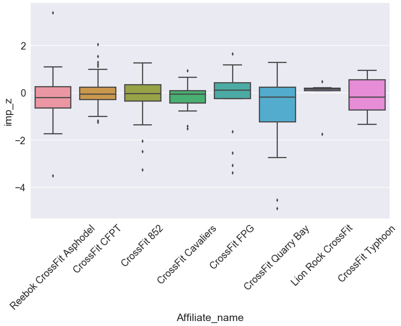
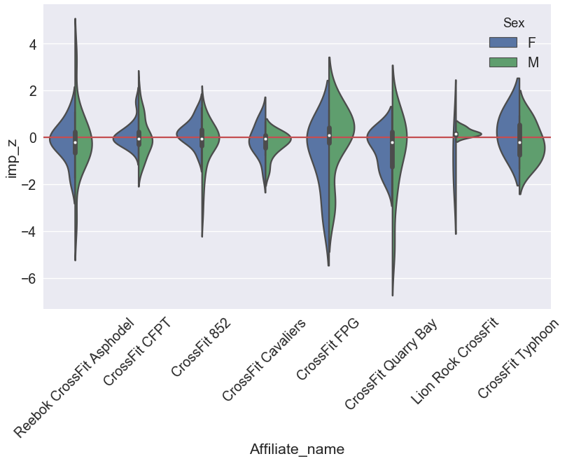
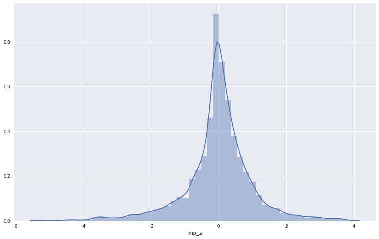

# Python And Data Analysis Project
Day 10 of Xccelerate Full-time Data Science Cohort 03  
Date: 29th Oct 2018

## 1. Define the Business Need
We are going to look at Crossfit Open 2018 and 2017 dataset provide by [Ray Bell](https://github.com/raybellwaves/cfanalytics/tree/master/Data). Jean-Michel Daignan wrote a [great piece](http://jmdaignan.com/2018/03/30/crossfitopen/) on how to scrape the Crossfit Game website as of 2018. The webscrapping part will be out of scope for this project. The focus will mainly be on data analysis.  

Using the open results from 2018 and 2017, we want to find which affliate serves its member in the best way. One indication of a great affliate is the community. Another is the quality of coaching. So in short we want to answer two questions:  
1. For a given `Region` which affliate improved its members' participation in the open the most, from 2017 to 2018?
2. For a given `Region` which affliate's athlete improved the most from 2017 to 2018?

## 2. Explore the Data


```python
import pandas as pd
import numpy as np

%matplotlib inline
import matplotlib.pyplot as plt
import matplotlib as mpl
import seaborn as sns

sns.set(color_codes=True) #overide maplot libs ugly colours.
mpl.rcParams['figure.figsize'] = [13, 8] #default figure size
```


```python
url_head = 'https://raw.githubusercontent.com/raybellwaves/cfanalytics/master/Data/'

l_18url = [
    url_head + 'Women_Rx_2018.csv',
    url_head + 'Men_Rx_2018.csv'
]

l_17url = [
    url_head + 'Women_Rx_2017.csv',
    url_head + 'Men_Rx_2017.csv'
]

gyms_url = url_head + 'Affiliate_list.csv'
```


```python
l_d17 = [pd.read_csv(iurl) for iurl in l_17url]
```

    /Users/JHO/.virtualenvs/accelerateHK3/lib/python3.6/site-packages/IPython/core/interactiveshell.py:2850: DtypeWarning: Columns (13,20) have mixed types. Specify dtype option on import or set low_memory=False.
      if self.run_code(code, result):


```python
l_d17[0].head(3)
```


<div>
<style scoped>
    .dataframe tbody tr th:only-of-type {
        vertical-align: middle;
    }

    .dataframe tbody tr th {
        vertical-align: top;
    }

    .dataframe thead th {
        text-align: right;
    }
</style>
<table border="1" class="dataframe">
  <thead>
    <tr style="text-align: right;">
      <th></th>
      <th>Unnamed: 0</th>
      <th>Userid</th>
      <th>Name</th>
      <th>Height (m)</th>
      <th>Weight (kg)</th>
      <th>Age</th>
      <th>Regionid</th>
      <th>Regionname</th>
      <th>Affiliateid</th>
      <th>Overallrank</th>
      <th>...</th>
      <th>17.3_score</th>
      <th>17.3_percentile</th>
      <th>17.3_predicted_reps</th>
      <th>17.4_rank</th>
      <th>17.4_score</th>
      <th>17.4_percentile</th>
      <th>17.5_rank</th>
      <th>17.5_score</th>
      <th>17.5_percentile</th>
      <th>17.5_predicted_time</th>
    </tr>
  </thead>
  <tbody>
    <tr>
      <th>0</th>
      <td>0</td>
      <td>8859</td>
      <td>Ragnheiður Sara Sigmundsdottir</td>
      <td>1.71</td>
      <td>69.0</td>
      <td>24</td>
      <td>6</td>
      <td>Central East</td>
      <td>0</td>
      <td>1</td>
      <td>...</td>
      <td>0 days 00:18:03</td>
      <td>99.9965</td>
      <td>287.0</td>
      <td>2</td>
      <td>328.0</td>
      <td>99.9987</td>
      <td>6</td>
      <td>0 days 00:06:32</td>
      <td>99.9928</td>
      <td>0 days 00:06:32.000000000</td>
    </tr>
    <tr>
      <th>1</th>
      <td>1</td>
      <td>305891</td>
      <td>Kari Pearce</td>
      <td>1.60</td>
      <td>NaN</td>
      <td>28</td>
      <td>11</td>
      <td>North East</td>
      <td>18553</td>
      <td>2</td>
      <td>...</td>
      <td>0 days 00:18:24</td>
      <td>99.9912</td>
      <td>282.0</td>
      <td>4</td>
      <td>320.0</td>
      <td>99.9961</td>
      <td>11</td>
      <td>0 days 00:06:44</td>
      <td>99.9856</td>
      <td>0 days 00:06:44.000000000</td>
    </tr>
    <tr>
      <th>2</th>
      <td>2</td>
      <td>8404</td>
      <td>Camille Leblanc-Bazinet</td>
      <td>1.57</td>
      <td>NaN</td>
      <td>28</td>
      <td>17</td>
      <td>South West</td>
      <td>386</td>
      <td>3</td>
      <td>...</td>
      <td>0 days 00:16:11</td>
      <td>99.9982</td>
      <td>320.0</td>
      <td>3</td>
      <td>325.0</td>
      <td>99.9974</td>
      <td>7</td>
      <td>0 days 00:06:34</td>
      <td>99.9913</td>
      <td>0 days 00:06:34.000000000</td>
    </tr>
  </tbody>
</table>
<p>3 rows × 30 columns</p>
</div>


```python
l_d18 = [pd.read_csv(iurl) for iurl in l_18url]
dgyms = pd.read_csv(gyms_url)
```

    /Users/JHO/.virtualenvs/accelerateHK3/lib/python3.6/site-packages/IPython/core/interactiveshell.py:2850: DtypeWarning: Columns (16,18,29) have mixed types. Specify dtype option on import or set low_memory=False.
      if self.run_code(code, result):
    /Users/JHO/.virtualenvs/accelerateHK3/lib/python3.6/site-packages/IPython/core/interactiveshell.py:2850: DtypeWarning: Columns (24,29) have mixed types. Specify dtype option on import or set low_memory=False.
      if self.run_code(code, result):


```python
l_d18[0].head(3)
```


<div>
<style scoped>
    .dataframe tbody tr th:only-of-type {
        vertical-align: middle;
    }

    .dataframe tbody tr th {
        vertical-align: top;
    }

    .dataframe thead th {
        text-align: right;
    }
</style>
<table border="1" class="dataframe">
  <thead>
    <tr style="text-align: right;">
      <th></th>
      <th>Unnamed: 0</th>
      <th>User_id</th>
      <th>Name</th>
      <th>Height_(m)</th>
      <th>Weight_(kg)</th>
      <th>Age</th>
      <th>Region_id</th>
      <th>Region_name</th>
      <th>Affiliate_id</th>
      <th>Overall_rank</th>
      <th>...</th>
      <th>18.3_predicted_time</th>
      <th>18.3_predicted_reps</th>
      <th>18.4_rank</th>
      <th>18.4_score</th>
      <th>18.4_percentile</th>
      <th>18.4_predicted_time</th>
      <th>18.4_predicted_reps</th>
      <th>18.5_rank</th>
      <th>18.5_score</th>
      <th>18.5_percentile</th>
    </tr>
  </thead>
  <tbody>
    <tr>
      <th>0</th>
      <td>0</td>
      <td>123582</td>
      <td>Cassidy Lance-Mcwherter</td>
      <td>1.60</td>
      <td>64.0</td>
      <td>30</td>
      <td>15</td>
      <td>South East</td>
      <td>16524</td>
      <td>1</td>
      <td>...</td>
      <td>NaN</td>
      <td>NaN</td>
      <td>8</td>
      <td>0 days 00:06:30</td>
      <td>99.9911</td>
      <td>0 days 00:06:30.000000000</td>
      <td>228.0</td>
      <td>10</td>
      <td>186.0</td>
      <td>99.9885</td>
    </tr>
    <tr>
      <th>1</th>
      <td>1</td>
      <td>2942</td>
      <td>Kara Saunders</td>
      <td>1.62</td>
      <td>73.0</td>
      <td>28</td>
      <td>21</td>
      <td>Australasia</td>
      <td>19961</td>
      <td>2</td>
      <td>...</td>
      <td>NaN</td>
      <td>NaN</td>
      <td>23</td>
      <td>0 days 00:06:51</td>
      <td>99.9720</td>
      <td>0 days 00:06:51.000000000</td>
      <td>217.0</td>
      <td>1</td>
      <td>201.0</td>
      <td>100.0000</td>
    </tr>
    <tr>
      <th>2</th>
      <td>2</td>
      <td>239148</td>
      <td>Carolyne Prevost</td>
      <td>1.60</td>
      <td>66.0</td>
      <td>28</td>
      <td>18</td>
      <td>Canada East</td>
      <td>718</td>
      <td>3</td>
      <td>...</td>
      <td>NaN</td>
      <td>NaN</td>
      <td>20</td>
      <td>0 days 00:06:49</td>
      <td>99.9758</td>
      <td>0 days 00:06:49.000000000</td>
      <td>218.0</td>
      <td>19</td>
      <td>183.0</td>
      <td>99.9770</td>
    </tr>
  </tbody>
</table>
<p>3 rows × 36 columns</p>
</div>


```python
l_d18[1].head(3)
```


<div>
<style scoped>
    .dataframe tbody tr th:only-of-type {
        vertical-align: middle;
    }

    .dataframe tbody tr th {
        vertical-align: top;
    }

    .dataframe thead th {
        text-align: right;
    }
</style>
<table border="1" class="dataframe">
  <thead>
    <tr style="text-align: right;">
      <th></th>
      <th>Unnamed: 0</th>
      <th>User_id</th>
      <th>Name</th>
      <th>Height_(m)</th>
      <th>Weight_(kg)</th>
      <th>Age</th>
      <th>Region_id</th>
      <th>Region_name</th>
      <th>Affiliate_id</th>
      <th>Overall_rank</th>
      <th>...</th>
      <th>18.3_predicted_time</th>
      <th>18.3_predicted_reps</th>
      <th>18.4_rank</th>
      <th>18.4_score</th>
      <th>18.4_percentile</th>
      <th>18.4_predicted_time</th>
      <th>18.4_predicted_reps</th>
      <th>18.5_rank</th>
      <th>18.5_score</th>
      <th>18.5_percentile</th>
    </tr>
  </thead>
  <tbody>
    <tr>
      <th>0</th>
      <td>0</td>
      <td>153604</td>
      <td>Mathew Fraser</td>
      <td>1.70</td>
      <td>86.0</td>
      <td>28</td>
      <td>6</td>
      <td>Central East</td>
      <td>3220</td>
      <td>1</td>
      <td>...</td>
      <td>0 days 00:14:11.000000000</td>
      <td>916.0</td>
      <td>5</td>
      <td>0 days 00:06:39</td>
      <td>99.9971</td>
      <td>0 days 00:06:39.000000000</td>
      <td>223.0</td>
      <td>1</td>
      <td>198.0</td>
      <td>100.0000</td>
    </tr>
    <tr>
      <th>1</th>
      <td>1</td>
      <td>180541</td>
      <td>Alex Vigneault</td>
      <td>1.80</td>
      <td>92.0</td>
      <td>26</td>
      <td>18</td>
      <td>Canada East</td>
      <td>10990</td>
      <td>2</td>
      <td>...</td>
      <td>0 days 00:15:55.000000000</td>
      <td>816.0</td>
      <td>7</td>
      <td>0 days 00:06:48</td>
      <td>99.9956</td>
      <td>0 days 00:06:48.000000000</td>
      <td>218.0</td>
      <td>47</td>
      <td>179.0</td>
      <td>99.9684</td>
    </tr>
    <tr>
      <th>2</th>
      <td>2</td>
      <td>702092</td>
      <td>Willy Georges</td>
      <td>1.79</td>
      <td>86.0</td>
      <td>25</td>
      <td>24</td>
      <td>Europe South</td>
      <td>16786</td>
      <td>3</td>
      <td>...</td>
      <td>0 days 00:14:50.000000000</td>
      <td>876.0</td>
      <td>168</td>
      <td>0 days 00:08:21</td>
      <td>99.8785</td>
      <td>0 days 00:08:21.000000000</td>
      <td>178.0</td>
      <td>5</td>
      <td>188.0</td>
      <td>99.9973</td>
    </tr>
  </tbody>
</table>
<p>3 rows × 36 columns</p>
</div>


#### 2017 and 2018 data columns are different, so we need to rename them


```python
col_map = {'Userid':'User_id', 
           'Height (m)': 'Height_(m)', 
           'Weight (kg)':'Weight_(kg)',
           'Regionid':'Region_id',
           'Regionname':'Region_name',
           'Affiliateid':'Affiliate_id',
           'Overallrank':'Overall_rank'}
l_d17 = [d.rename(columns = col_map) for d in l_d17]
l_d17[0].head(3)

```


```python
dgyms.head(3)
```


<div>
<style scoped>
    .dataframe tbody tr th:only-of-type {
        vertical-align: middle;
    }

    .dataframe tbody tr th {
        vertical-align: top;
    }

    .dataframe thead th {
        text-align: right;
    }
</style>
<table border="1" class="dataframe">
  <thead>
    <tr style="text-align: right;">
      <th></th>
      <th>Unnamed: 0</th>
      <th>Affiliate_id</th>
      <th>Affiliate_name</th>
      <th>Address</th>
      <th>City</th>
      <th>State</th>
      <th>Zip</th>
      <th>Country</th>
      <th>Website</th>
      <th>Phone</th>
      <th>Latitude</th>
      <th>Longitude</th>
    </tr>
  </thead>
  <tbody>
    <tr>
      <th>0</th>
      <td>0</td>
      <td>3</td>
      <td>CrossFit Persist</td>
      <td>165 Amboy Ave, #705</td>
      <td>Morganville</td>
      <td>NJ</td>
      <td>07751</td>
      <td>United States</td>
      <td>http://www.crossfitpersist.com/</td>
      <td>(732) 687-1050</td>
      <td>40.3604</td>
      <td>-74.2894</td>
    </tr>
    <tr>
      <th>1</th>
      <td>1</td>
      <td>4</td>
      <td>Far North CrossFit</td>
      <td>17 Finlayson Street</td>
      <td>Whangarei</td>
      <td>Northland</td>
      <td>0110</td>
      <td>New Zealand</td>
      <td>http://www.farnorthcrossfit.com</td>
      <td>021 022 09234</td>
      <td>-35.7270</td>
      <td>174.3274</td>
    </tr>
    <tr>
      <th>2</th>
      <td>2</td>
      <td>5</td>
      <td>CrossFit Dubuque</td>
      <td>3080 Cedar Crest Ct.</td>
      <td>Dubuque</td>
      <td>IA</td>
      <td>52003</td>
      <td>United States</td>
      <td>http://crossfitdubuque.com/</td>
      <td>(563) 552-8423</td>
      <td>42.4787</td>
      <td>-90.7068</td>
    </tr>
  </tbody>
</table>
</div>


### Cleaning the data
In the data frame that we want, we just want to have **region data**, **Overall_rank**, and a new column for **sex**


```python
def JoinAllAthletes( df_ladies, df_men):
    l_columns = ['User_id', 'Name', 'Height_(m)', 'Weight_(kg)','Age',
                 'Region_id','Region_name','Affiliate_id','Overall_rank']
    dfl = df_ladies.loc[:, l_columns].set_index('User_id')
    dfm = df_men.loc[:, l_columns].set_index('User_id')
    dfl['Sex'] = 'F'
    dfm['Sex'] = 'M'
    
    return pd.concat([dfl, dfm])

JoinAllAthletes( l_d18[0], l_d18[1]).sample(10)
```


<div>
<style scoped>
    .dataframe tbody tr th:only-of-type {
        vertical-align: middle;
    }

    .dataframe tbody tr th {
        vertical-align: top;
    }

    .dataframe thead th {
        text-align: right;
    }
</style>
<table border="1" class="dataframe">
  <thead>
    <tr style="text-align: right;">
      <th></th>
      <th>Name</th>
      <th>Height_(m)</th>
      <th>Weight_(kg)</th>
      <th>Age</th>
      <th>Region_id</th>
      <th>Region_name</th>
      <th>Affiliate_id</th>
      <th>Overall_rank</th>
      <th>Sex</th>
    </tr>
    <tr>
      <th>User_id</th>
      <th></th>
      <th></th>
      <th></th>
      <th></th>
      <th></th>
      <th></th>
      <th></th>
      <th></th>
      <th></th>
    </tr>
  </thead>
  <tbody>
    <tr>
      <th>313684</th>
      <td>Deryn Macey</td>
      <td>1.65</td>
      <td>77.0</td>
      <td>35</td>
      <td>5</td>
      <td>Canada West</td>
      <td>1285</td>
      <td>26504</td>
      <td>F</td>
    </tr>
    <tr>
      <th>727319</th>
      <td>Diana Kjærulff</td>
      <td>1.70</td>
      <td>88.0</td>
      <td>36</td>
      <td>22</td>
      <td>Europe North</td>
      <td>19197</td>
      <td>93988</td>
      <td>F</td>
    </tr>
    <tr>
      <th>1322281</th>
      <td>Simon Martin</td>
      <td>NaN</td>
      <td>NaN</td>
      <td>41</td>
      <td>21</td>
      <td>Australasia</td>
      <td>19914</td>
      <td>169731</td>
      <td>M</td>
    </tr>
    <tr>
      <th>1327407</th>
      <td>Aly Passarelli</td>
      <td>1.45</td>
      <td>68.0</td>
      <td>37</td>
      <td>11</td>
      <td>North East</td>
      <td>0</td>
      <td>29662</td>
      <td>F</td>
    </tr>
    <tr>
      <th>903965</th>
      <td>Tiphaine Kubiak</td>
      <td>1.56</td>
      <td>51.0</td>
      <td>26</td>
      <td>24</td>
      <td>Europe South</td>
      <td>10857</td>
      <td>61687</td>
      <td>F</td>
    </tr>
    <tr>
      <th>276609</th>
      <td>Paul Watters</td>
      <td>NaN</td>
      <td>97.0</td>
      <td>40</td>
      <td>21</td>
      <td>Australasia</td>
      <td>9015</td>
      <td>9877</td>
      <td>M</td>
    </tr>
    <tr>
      <th>1396681</th>
      <td>Kristina Folsom</td>
      <td>NaN</td>
      <td>NaN</td>
      <td>32</td>
      <td>19</td>
      <td>West Coast</td>
      <td>7025</td>
      <td>75041</td>
      <td>F</td>
    </tr>
    <tr>
      <th>1398112</th>
      <td>Veronika Vrazelova</td>
      <td>NaN</td>
      <td>NaN</td>
      <td>26</td>
      <td>23</td>
      <td>Europe Central</td>
      <td>20846</td>
      <td>29264</td>
      <td>F</td>
    </tr>
    <tr>
      <th>1361450</th>
      <td>Julio Cesar Silveira Bueno</td>
      <td>NaN</td>
      <td>NaN</td>
      <td>22</td>
      <td>27</td>
      <td>South America</td>
      <td>10010</td>
      <td>82041</td>
      <td>M</td>
    </tr>
    <tr>
      <th>1128720</th>
      <td>Maggie Heaton</td>
      <td>NaN</td>
      <td>NaN</td>
      <td>24</td>
      <td>11</td>
      <td>North East</td>
      <td>15443</td>
      <td>4434</td>
      <td>F</td>
    </tr>
  </tbody>
</table>
</div>


### Are there any missing data?


```python
df_18 = JoinAllAthletes( l_d18[0], l_d18[1])
df_17 = JoinAllAthletes( l_d17[0], l_d17[1])

def GetMissing(in_df):
    missing_filter = [in_df.Overall_rank.isna(),
                     in_df.Affiliate_id.isna(),
                     in_df.Affiliate_id == 0,
                     in_df.Region_id.isna(),
                     in_df.Region_id ==0]

    from functools import reduce
    dfilter = reduce( lambda x, y : x | y, missing_filter)
    return dfilter

df18 = df_18[~(GetMissing(df_18))] # '~' is for filter negation
df17 = df_17[~(GetMissing(df_17))]

print(f'For 2018: {len(df_18)} total athletes, {len(df18)} athletes have the crucial data. That is {len(df18)/ len(df_18) * 100} percent\n\n')
print(f'For 2017: {len(df_17)} total athletes, {len(df17)} athletes have the crucial data. That is {len(df17)/ len(df_17) * 100} percent')
```

    For 2018: 303956 total athletes, 287564 athletes have the crucial data. That is 94.60711418757978 percent
    
    
    For 2017: 273670 total athletes, 261126 athletes have the crucial data. That is 95.41637738882596 percent


## 3. Analyse the Data

Since the data set is pretty big, we are going to select a `Region` or maybe even a city first for speed of computation

### For the Asia Region, which affiliate increased their Open participation the most?


```python
df18_ = df18[df18.Region_name=='Asia'].groupby('Affiliate_id')['Name'].agg({'Athlete_count': 'count'})
df17_ = df17[df17.Region_name=='Asia'].groupby('Affiliate_id')['Name'].agg({'Athlete_count': 'count'})

```

    /Users/JHO/.virtualenvs/accelerateHK3/lib/python3.6/site-packages/ipykernel_launcher.py:1: FutureWarning: using a dict on a Series for aggregation
    is deprecated and will be removed in a future version
      """Entry point for launching an IPython kernel.
    /Users/JHO/.virtualenvs/accelerateHK3/lib/python3.6/site-packages/ipykernel_launcher.py:2: FutureWarning: using a dict on a Series for aggregation
    is deprecated and will be removed in a future version
      


```python
def GetACount(in_df, a_id):
    nfilter = in_df.index == a_id
    if sum( nfilter ) == 0:
        return np.nan
    else:
        return int(in_df[ nfilter ]['Athlete_count'].values)
df18_['2017_Athletes'] = df18_.index.map(lambda x: GetACount(df17_, x))
df18_['change'] = df18_['Athlete_count'] - df18_['2017_Athletes']
df18_['pct_change'] = df18_['Athlete_count'] / df18_['2017_Athletes'] -1
df18_.sort_values(by= 'change', ascending=False).head(3)
```


<div>
<style scoped>
    .dataframe tbody tr th:only-of-type {
        vertical-align: middle;
    }

    .dataframe tbody tr th {
        vertical-align: top;
    }

    .dataframe thead th {
        text-align: right;
    }
</style>
<table border="1" class="dataframe">
  <thead>
    <tr style="text-align: right;">
      <th></th>
      <th>Athlete_count</th>
      <th>2017_Athletes</th>
      <th>change</th>
      <th>pct_change</th>
    </tr>
    <tr>
      <th>Affiliate_id</th>
      <th></th>
      <th></th>
      <th></th>
      <th></th>
    </tr>
  </thead>
  <tbody>
    <tr>
      <th>1971</th>
      <td>192</td>
      <td>138.0</td>
      <td>54.0</td>
      <td>0.391304</td>
    </tr>
    <tr>
      <th>13557</th>
      <td>78</td>
      <td>37.0</td>
      <td>41.0</td>
      <td>1.108108</td>
    </tr>
    <tr>
      <th>4947</th>
      <td>41</td>
      <td>4.0</td>
      <td>37.0</td>
      <td>9.250000</td>
    </tr>
  </tbody>
</table>
</div>


### The Top 15 Asia Affiliates that increased their Open Participation the most are...


```python
def GetAffiliateDet( a_id, colname):
    dfilter = dgyms.Affiliate_id == a_id
    if sum(dfilter) == 0:
        return np.nan
    else:
        return dgyms[dfilter][colname].values[0]

#GetAffiliateName(18157)

df18_['Affiliate_name'] = df18_.index.map(lambda x: GetAffiliateDet(x, 'Affiliate_name'))
df18_['Country'] = df18_.index.map(lambda x: GetAffiliateDet(x, 'Country'))
df18_.sort_values(by= 'change', ascending=False).head(15)
```


<div>
<style scoped>
    .dataframe tbody tr th:only-of-type {
        vertical-align: middle;
    }

    .dataframe tbody tr th {
        vertical-align: top;
    }

    .dataframe thead th {
        text-align: right;
    }
</style>
<table border="1" class="dataframe">
  <thead>
    <tr style="text-align: right;">
      <th></th>
      <th>Athlete_count</th>
      <th>2017_Athletes</th>
      <th>change</th>
      <th>pct_change</th>
      <th>Affiliate_name</th>
      <th>Country</th>
    </tr>
    <tr>
      <th>Affiliate_id</th>
      <th></th>
      <th></th>
      <th></th>
      <th></th>
      <th></th>
      <th></th>
    </tr>
  </thead>
  <tbody>
    <tr>
      <th>1971</th>
      <td>192</td>
      <td>138.0</td>
      <td>54.0</td>
      <td>0.391304</td>
      <td>CrossFit Gangnam</td>
      <td>Korea, Republic of</td>
    </tr>
    <tr>
      <th>13557</th>
      <td>78</td>
      <td>37.0</td>
      <td>41.0</td>
      <td>1.108108</td>
      <td>CrossFit 6221</td>
      <td>Indonesia</td>
    </tr>
    <tr>
      <th>4947</th>
      <td>41</td>
      <td>4.0</td>
      <td>37.0</td>
      <td>9.250000</td>
      <td>CrossFit Senayan</td>
      <td>Indonesia</td>
    </tr>
    <tr>
      <th>17422</th>
      <td>43</td>
      <td>7.0</td>
      <td>36.0</td>
      <td>5.142857</td>
      <td>Elite Zone CrossFit</td>
      <td>Malaysia</td>
    </tr>
    <tr>
      <th>87</th>
      <td>42</td>
      <td>6.0</td>
      <td>36.0</td>
      <td>6.000000</td>
      <td>Humphreys CrossFit</td>
      <td>Korea, Republic of</td>
    </tr>
    <tr>
      <th>15879</th>
      <td>44</td>
      <td>18.0</td>
      <td>26.0</td>
      <td>1.444444</td>
      <td>CrossFit Loga</td>
      <td>Taiwan</td>
    </tr>
    <tr>
      <th>18157</th>
      <td>36</td>
      <td>11.0</td>
      <td>25.0</td>
      <td>2.272727</td>
      <td>Reebok CrossFit Asphodel</td>
      <td>Hong Kong</td>
    </tr>
    <tr>
      <th>10722</th>
      <td>49</td>
      <td>24.0</td>
      <td>25.0</td>
      <td>1.041667</td>
      <td>CrossFit Hakata</td>
      <td>Japan</td>
    </tr>
    <tr>
      <th>3170</th>
      <td>38</td>
      <td>15.0</td>
      <td>23.0</td>
      <td>1.533333</td>
      <td>CrossFit Himalaya</td>
      <td>India</td>
    </tr>
    <tr>
      <th>18438</th>
      <td>24</td>
      <td>3.0</td>
      <td>21.0</td>
      <td>7.000000</td>
      <td>CrossFit Vyom</td>
      <td>India</td>
    </tr>
    <tr>
      <th>18414</th>
      <td>21</td>
      <td>1.0</td>
      <td>20.0</td>
      <td>20.000000</td>
      <td>TFD CrossFit</td>
      <td>India</td>
    </tr>
    <tr>
      <th>10506</th>
      <td>120</td>
      <td>100.0</td>
      <td>20.0</td>
      <td>0.200000</td>
      <td>CrossFit Apgujeong</td>
      <td>Korea, Republic of</td>
    </tr>
    <tr>
      <th>10774</th>
      <td>64</td>
      <td>45.0</td>
      <td>19.0</td>
      <td>0.422222</td>
      <td>CrossFit Bukit Timah</td>
      <td>Singapore</td>
    </tr>
    <tr>
      <th>9367</th>
      <td>50</td>
      <td>34.0</td>
      <td>16.0</td>
      <td>0.470588</td>
      <td>CrossFit Moodori</td>
      <td>Korea, Republic of</td>
    </tr>
    <tr>
      <th>3190</th>
      <td>24</td>
      <td>8.0</td>
      <td>16.0</td>
      <td>2.000000</td>
      <td>CrossFit Chiang Mai</td>
      <td>Thailand</td>
    </tr>
  </tbody>
</table>
</div>


### And the Top 15 Asia Affiliates with the most Open 2018 Participation


```python
df18_.sort_values(by= 'Athlete_count', ascending=False).head(15)
```


<div>
<style scoped>
    .dataframe tbody tr th:only-of-type {
        vertical-align: middle;
    }

    .dataframe tbody tr th {
        vertical-align: top;
    }

    .dataframe thead th {
        text-align: right;
    }
</style>
<table border="1" class="dataframe">
  <thead>
    <tr style="text-align: right;">
      <th></th>
      <th>Athlete_count</th>
      <th>2017_Athletes</th>
      <th>change</th>
      <th>Affiliate_name</th>
      <th>Country</th>
    </tr>
    <tr>
      <th>Affiliate_id</th>
      <th></th>
      <th></th>
      <th></th>
      <th></th>
      <th></th>
    </tr>
  </thead>
  <tbody>
    <tr>
      <th>1971</th>
      <td>192</td>
      <td>138.0</td>
      <td>54.0</td>
      <td>CrossFit Gangnam</td>
      <td>Korea, Republic of</td>
    </tr>
    <tr>
      <th>10506</th>
      <td>120</td>
      <td>100.0</td>
      <td>20.0</td>
      <td>CrossFit Apgujeong</td>
      <td>Korea, Republic of</td>
    </tr>
    <tr>
      <th>12640</th>
      <td>82</td>
      <td>113.0</td>
      <td>-31.0</td>
      <td>CrossFit Redyar</td>
      <td>Russian Federation</td>
    </tr>
    <tr>
      <th>4574</th>
      <td>80</td>
      <td>81.0</td>
      <td>-1.0</td>
      <td>CrossFit EKB</td>
      <td>Russian Federation</td>
    </tr>
    <tr>
      <th>13557</th>
      <td>78</td>
      <td>37.0</td>
      <td>41.0</td>
      <td>CrossFit 6221</td>
      <td>Indonesia</td>
    </tr>
    <tr>
      <th>9402</th>
      <td>73</td>
      <td>59.0</td>
      <td>14.0</td>
      <td>East West CrossFit</td>
      <td>Thailand</td>
    </tr>
    <tr>
      <th>5724</th>
      <td>72</td>
      <td>59.0</td>
      <td>13.0</td>
      <td>Reebok CrossFit MeWellness</td>
      <td>China</td>
    </tr>
    <tr>
      <th>6582</th>
      <td>67</td>
      <td>82.0</td>
      <td>-15.0</td>
      <td>CrossFit Teddygym</td>
      <td>Korea, Republic of</td>
    </tr>
    <tr>
      <th>5827</th>
      <td>66</td>
      <td>56.0</td>
      <td>10.0</td>
      <td>CrossFit Gof Metgot</td>
      <td>Guam</td>
    </tr>
    <tr>
      <th>10774</th>
      <td>64</td>
      <td>45.0</td>
      <td>19.0</td>
      <td>CrossFit Bukit Timah</td>
      <td>Singapore</td>
    </tr>
    <tr>
      <th>2711</th>
      <td>63</td>
      <td>55.0</td>
      <td>8.0</td>
      <td>CrossFit Berloga</td>
      <td>Russian Federation</td>
    </tr>
    <tr>
      <th>6874</th>
      <td>62</td>
      <td>66.0</td>
      <td>-4.0</td>
      <td>CrossFit CFPT</td>
      <td>Hong Kong</td>
    </tr>
    <tr>
      <th>8725</th>
      <td>61</td>
      <td>52.0</td>
      <td>9.0</td>
      <td>CrossFit Mobilus</td>
      <td>Singapore</td>
    </tr>
    <tr>
      <th>15581</th>
      <td>61</td>
      <td>59.0</td>
      <td>2.0</td>
      <td>CrossFit Lah</td>
      <td>Malaysia</td>
    </tr>
    <tr>
      <th>5725</th>
      <td>59</td>
      <td>63.0</td>
      <td>-4.0</td>
      <td>CrossFit 852</td>
      <td>Hong Kong</td>
    </tr>
  </tbody>
</table>
</div>


### And who's open participation shrinked?


```python
df18_.sort_values(by= 'change', ascending=True).head(15)
```


<div>
<style scoped>
    .dataframe tbody tr th:only-of-type {
        vertical-align: middle;
    }

    .dataframe tbody tr th {
        vertical-align: top;
    }

    .dataframe thead th {
        text-align: right;
    }
</style>
<table border="1" class="dataframe">
  <thead>
    <tr style="text-align: right;">
      <th></th>
      <th>Athlete_count</th>
      <th>2017_Athletes</th>
      <th>change</th>
      <th>Affiliate_name</th>
      <th>Country</th>
    </tr>
    <tr>
      <th>Affiliate_id</th>
      <th></th>
      <th></th>
      <th></th>
      <th></th>
      <th></th>
    </tr>
  </thead>
  <tbody>
    <tr>
      <th>15446</th>
      <td>9</td>
      <td>110.0</td>
      <td>-101.0</td>
      <td>CrossFit Pangyo Avenue</td>
      <td>Korea, Republic of</td>
    </tr>
    <tr>
      <th>8987</th>
      <td>9</td>
      <td>61.0</td>
      <td>-52.0</td>
      <td>CrossFit 1229</td>
      <td>Philippines</td>
    </tr>
    <tr>
      <th>10569</th>
      <td>2</td>
      <td>41.0</td>
      <td>-39.0</td>
      <td>CrossFit Choigang</td>
      <td>Korea, Republic of</td>
    </tr>
    <tr>
      <th>12680</th>
      <td>26</td>
      <td>57.0</td>
      <td>-31.0</td>
      <td>CrossFit Pahlawan</td>
      <td>Malaysia</td>
    </tr>
    <tr>
      <th>12640</th>
      <td>82</td>
      <td>113.0</td>
      <td>-31.0</td>
      <td>CrossFit Redyar</td>
      <td>Russian Federation</td>
    </tr>
    <tr>
      <th>18449</th>
      <td>36</td>
      <td>65.0</td>
      <td>-29.0</td>
      <td>CrossFit RTBC</td>
      <td>Russian Federation</td>
    </tr>
    <tr>
      <th>16527</th>
      <td>6</td>
      <td>34.0</td>
      <td>-28.0</td>
      <td>CrossFit IDOL 2</td>
      <td>Kazakhstan</td>
    </tr>
    <tr>
      <th>18757</th>
      <td>23</td>
      <td>50.0</td>
      <td>-27.0</td>
      <td>CrossFit Kuching</td>
      <td>Malaysia</td>
    </tr>
    <tr>
      <th>952</th>
      <td>51</td>
      <td>71.0</td>
      <td>-20.0</td>
      <td>CrossFit Asia</td>
      <td>Japan</td>
    </tr>
    <tr>
      <th>8304</th>
      <td>13</td>
      <td>33.0</td>
      <td>-20.0</td>
      <td>CrossFit SteamPunk</td>
      <td>Korea, Republic of</td>
    </tr>
    <tr>
      <th>14480</th>
      <td>5</td>
      <td>25.0</td>
      <td>-20.0</td>
      <td>HNXT CrossFit</td>
      <td>Korea, Republic of</td>
    </tr>
    <tr>
      <th>18801</th>
      <td>20</td>
      <td>40.0</td>
      <td>-20.0</td>
      <td>Modu CrossFit</td>
      <td>Korea, Republic of</td>
    </tr>
    <tr>
      <th>11421</th>
      <td>25</td>
      <td>45.0</td>
      <td>-20.0</td>
      <td>CrossFit Stride</td>
      <td>India</td>
    </tr>
    <tr>
      <th>8994</th>
      <td>4</td>
      <td>23.0</td>
      <td>-19.0</td>
      <td>CrossFit Primero</td>
      <td>India</td>
    </tr>
    <tr>
      <th>16155</th>
      <td>1</td>
      <td>19.0</td>
      <td>-18.0</td>
      <td>Tsunami Elite CrossFit</td>
      <td>China</td>
    </tr>
  </tbody>
</table>
</div>


### For the Asia Region, which affiliate improved their Open Athletes' performance the most?
Where the improve in preformance is the total number of rank improved for all athletes who completed both in 2017 and 2018.


```python
col_to_keep = ['Name','Age','Affiliate_id','Overall_rank','Sex']
df18a = df18[df18.Region_name=='Asia'].loc[:, col_to_keep]

def GetRank(in_df, strName):
    nfilter = in_df.Name == strName
    if sum( nfilter ) == 0:
        return np.nan
    else:
        return in_df[ nfilter ]['Overall_rank'].values[0]

#GetRank(df17, 'Jamie Greene')

df18a['rank17'] = df18a.Name.apply(lambda x: GetRank(df17, x))
```


```python
print(f'{sum(df18a.rank17.isna())} of {len(df18a)} athletes are missing 2017 data. That is {sum(df18a.rank17.isna())/ len(df18a)*100} percent.')
```

    3973 of 7142 athletes are missing 2017 data. That is 55.62867544105292 percent.


```python
df18a = df18a.dropna(subset=['rank17'])
df18a['improvement']= df18a['rank17'] - df18a['Overall_rank']
df18a['Affiliate_name'] = df18a.Affiliate_id.map(lambda x: GetAffiliateDet(x, 'Affiliate_name'))
df18a['Country'] = df18a.Affiliate_id.map(lambda x: GetAffiliateDet(x, 'Country'))
```

### Just for fun, let's see the top 10 most improved athletes in Asia


```python
df18a.sort_values(by ='improvement', ascending = False)[df18a.Sex=='M'].head(10)
```

    /Users/JHO/.virtualenvs/accelerateHK3/lib/python3.6/site-packages/ipykernel_launcher.py:1: UserWarning: Boolean Series key will be reindexed to match DataFrame index.
      """Entry point for launching an IPython kernel.


<div>
<style scoped>
    .dataframe tbody tr th:only-of-type {
        vertical-align: middle;
    }

    .dataframe tbody tr th {
        vertical-align: top;
    }

    .dataframe thead th {
        text-align: right;
    }
</style>
<table border="1" class="dataframe">
  <thead>
    <tr style="text-align: right;">
      <th></th>
      <th>Name</th>
      <th>Age</th>
      <th>Affiliate_id</th>
      <th>Overall_rank</th>
      <th>Sex</th>
      <th>rank17</th>
      <th>improvement</th>
      <th>Affiliate_name</th>
      <th>Country</th>
    </tr>
    <tr>
      <th>User_id</th>
      <th></th>
      <th></th>
      <th></th>
      <th></th>
      <th></th>
      <th></th>
      <th></th>
      <th></th>
      <th></th>
    </tr>
  </thead>
  <tbody>
    <tr>
      <th>319745</th>
      <td>Keith Stillman</td>
      <td>27</td>
      <td>17764</td>
      <td>2763</td>
      <td>M</td>
      <td>151198.0</td>
      <td>148435.0</td>
      <td>Port Tower CrossFit</td>
      <td>Japan</td>
    </tr>
    <tr>
      <th>57487</th>
      <td>Kim Jwa-Nyeon</td>
      <td>43</td>
      <td>9025</td>
      <td>34873</td>
      <td>M</td>
      <td>179933.0</td>
      <td>145060.0</td>
      <td>CrossFit LOL</td>
      <td>Korea, Republic of</td>
    </tr>
    <tr>
      <th>1363804</th>
      <td>Timofey Bakhurinskiy</td>
      <td>25</td>
      <td>14672</td>
      <td>3815</td>
      <td>M</td>
      <td>148447.0</td>
      <td>144632.0</td>
      <td>CrossFit Astana</td>
      <td>Kazakhstan</td>
    </tr>
    <tr>
      <th>733891</th>
      <td>Zachary Thibodaux</td>
      <td>24</td>
      <td>2466</td>
      <td>13953</td>
      <td>M</td>
      <td>155611.0</td>
      <td>141658.0</td>
      <td>Fight Tonight CrossFit</td>
      <td>Korea, Republic of</td>
    </tr>
    <tr>
      <th>967176</th>
      <td>Eunwoong Lee</td>
      <td>24</td>
      <td>17675</td>
      <td>41171</td>
      <td>M</td>
      <td>182305.0</td>
      <td>141134.0</td>
      <td>CrossFit MATE</td>
      <td>Korea, Republic of</td>
    </tr>
    <tr>
      <th>752725</th>
      <td>Lee Byeong Su</td>
      <td>27</td>
      <td>16143</td>
      <td>48961</td>
      <td>M</td>
      <td>189840.0</td>
      <td>140879.0</td>
      <td>CrossFit Shout</td>
      <td>Korea, Republic of</td>
    </tr>
    <tr>
      <th>278578</th>
      <td>JiMoo Son</td>
      <td>27</td>
      <td>17606</td>
      <td>291</td>
      <td>M</td>
      <td>139217.0</td>
      <td>138926.0</td>
      <td>CrossFit Limelight</td>
      <td>Korea, Republic of</td>
    </tr>
    <tr>
      <th>879011</th>
      <td>Xingchen Li</td>
      <td>30</td>
      <td>17439</td>
      <td>12561</td>
      <td>M</td>
      <td>149311.0</td>
      <td>136750.0</td>
      <td>Attitude CrossFit</td>
      <td>China</td>
    </tr>
    <tr>
      <th>1097087</th>
      <td>Paolo Volpe</td>
      <td>30</td>
      <td>13557</td>
      <td>41938</td>
      <td>M</td>
      <td>178364.0</td>
      <td>136426.0</td>
      <td>CrossFit 6221</td>
      <td>Indonesia</td>
    </tr>
    <tr>
      <th>496740</th>
      <td>Hogun Hwang</td>
      <td>28</td>
      <td>6582</td>
      <td>6292</td>
      <td>M</td>
      <td>141781.0</td>
      <td>135489.0</td>
      <td>CrossFit Teddygym</td>
      <td>Korea, Republic of</td>
    </tr>
  </tbody>
</table>
</div>


```python
df18a.sort_values(by ='improvement', ascending = False)[df18a.Sex=='F'].head(10)
```

    /Users/JHO/.virtualenvs/accelerateHK3/lib/python3.6/site-packages/ipykernel_launcher.py:1: UserWarning: Boolean Series key will be reindexed to match DataFrame index.
      """Entry point for launching an IPython kernel.


<div>
<style scoped>
    .dataframe tbody tr th:only-of-type {
        vertical-align: middle;
    }

    .dataframe tbody tr th {
        vertical-align: top;
    }

    .dataframe thead th {
        text-align: right;
    }
</style>
<table border="1" class="dataframe">
  <thead>
    <tr style="text-align: right;">
      <th></th>
      <th>Name</th>
      <th>Age</th>
      <th>Affiliate_id</th>
      <th>Overall_rank</th>
      <th>Sex</th>
      <th>rank17</th>
      <th>improvement</th>
      <th>Affiliate_name</th>
      <th>Country</th>
    </tr>
    <tr>
      <th>User_id</th>
      <th></th>
      <th></th>
      <th></th>
      <th></th>
      <th></th>
      <th></th>
      <th></th>
      <th></th>
      <th></th>
    </tr>
  </thead>
  <tbody>
    <tr>
      <th>1232051</th>
      <td>Xin Li</td>
      <td>30</td>
      <td>16529</td>
      <td>53374</td>
      <td>F</td>
      <td>176131.0</td>
      <td>122757.0</td>
      <td>Chuncheng CrossFit</td>
      <td>China</td>
    </tr>
    <tr>
      <th>517966</th>
      <td>Angela Walter</td>
      <td>20</td>
      <td>87</td>
      <td>7592</td>
      <td>F</td>
      <td>125564.0</td>
      <td>117972.0</td>
      <td>Humphreys CrossFit</td>
      <td>Korea, Republic of</td>
    </tr>
    <tr>
      <th>131387</th>
      <td>Megumi Goto</td>
      <td>38</td>
      <td>17256</td>
      <td>16643</td>
      <td>F</td>
      <td>124246.0</td>
      <td>107603.0</td>
      <td>CrossFit Daikanyama</td>
      <td>Japan</td>
    </tr>
    <tr>
      <th>620569</th>
      <td>Missy Elwell</td>
      <td>42</td>
      <td>10620</td>
      <td>11452</td>
      <td>F</td>
      <td>114797.0</td>
      <td>103345.0</td>
      <td>Unified CrossFit</td>
      <td>Guam</td>
    </tr>
    <tr>
      <th>704000</th>
      <td>Si Yu Chen</td>
      <td>35</td>
      <td>14720</td>
      <td>27295</td>
      <td>F</td>
      <td>123327.0</td>
      <td>96032.0</td>
      <td>CrossFit Body in Motion HuangPu</td>
      <td>China</td>
    </tr>
    <tr>
      <th>666423</th>
      <td>Jun Ge</td>
      <td>34</td>
      <td>10774</td>
      <td>30445</td>
      <td>F</td>
      <td>125426.0</td>
      <td>94981.0</td>
      <td>CrossFit Bukit Timah</td>
      <td>Singapore</td>
    </tr>
    <tr>
      <th>1274148</th>
      <td>Boram Kim</td>
      <td>34</td>
      <td>15927</td>
      <td>90451</td>
      <td>F</td>
      <td>184904.0</td>
      <td>94453.0</td>
      <td>CrossFit GUTS</td>
      <td>Korea, Republic of</td>
    </tr>
    <tr>
      <th>767317</th>
      <td>Bobo Yu</td>
      <td>37</td>
      <td>12637</td>
      <td>38721</td>
      <td>F</td>
      <td>119471.0</td>
      <td>80750.0</td>
      <td>Terracotta CrossFit</td>
      <td>China</td>
    </tr>
    <tr>
      <th>649525</th>
      <td>Yuki Day</td>
      <td>35</td>
      <td>12599</td>
      <td>42158</td>
      <td>F</td>
      <td>120180.0</td>
      <td>78022.0</td>
      <td>CrossFit Habu</td>
      <td>Japan</td>
    </tr>
    <tr>
      <th>535011</th>
      <td>Marissa Romero</td>
      <td>29</td>
      <td>16917</td>
      <td>57444</td>
      <td>F</td>
      <td>131033.0</td>
      <td>73589.0</td>
      <td>CrossFit Phuket</td>
      <td>Thailand</td>
    </tr>
  </tbody>
</table>
</div>


```python
df18ag = df18a.groupby('Affiliate_id')['improvement'].agg({'Num_Athletes': 'count', 
                                                           'Total_rank_improved': 'sum', 
                                                           'Avg_rank_improved': 'mean',
                                                           'Median_rank_improved': 'median'})
df18ag['Affiliate_name'] = df18ag.index.map(lambda x: GetAffiliateDet(x, 'Affiliate_name'))
df18ag['Country'] = df18ag.index.map(lambda x: GetAffiliateDet(x, 'Country'))
df18ag.sort_values( by = 'Total_rank_improved', ascending = False).head(15)
```

    /Users/JHO/.virtualenvs/accelerateHK3/lib/python3.6/site-packages/ipykernel_launcher.py:4: FutureWarning: using a dict on a Series for aggregation
    is deprecated and will be removed in a future version
      after removing the cwd from sys.path.


<div>
<style scoped>
    .dataframe tbody tr th:only-of-type {
        vertical-align: middle;
    }

    .dataframe tbody tr th {
        vertical-align: top;
    }

    .dataframe thead th {
        text-align: right;
    }
</style>
<table border="1" class="dataframe">
  <thead>
    <tr style="text-align: right;">
      <th></th>
      <th>Num_Athletes</th>
      <th>Total_rank_improved</th>
      <th>Avg_rank_improved</th>
      <th>Median_rank_improved</th>
      <th>Affiliate_name</th>
      <th>Country</th>
    </tr>
    <tr>
      <th>Affiliate_id</th>
      <th></th>
      <th></th>
      <th></th>
      <th></th>
      <th></th>
      <th></th>
    </tr>
  </thead>
  <tbody>
    <tr>
      <th>4574</th>
      <td>39</td>
      <td>590534.0</td>
      <td>15141.897436</td>
      <td>9924.0</td>
      <td>CrossFit EKB</td>
      <td>Russian Federation</td>
    </tr>
    <tr>
      <th>14574</th>
      <td>23</td>
      <td>515447.0</td>
      <td>22410.739130</td>
      <td>13294.0</td>
      <td>Actualize CrossFit</td>
      <td>Singapore</td>
    </tr>
    <tr>
      <th>18507</th>
      <td>12</td>
      <td>501346.0</td>
      <td>41778.833333</td>
      <td>30873.0</td>
      <td>CrossFit RK Olympicpark</td>
      <td>Korea, Republic of</td>
    </tr>
    <tr>
      <th>12640</th>
      <td>51</td>
      <td>443793.0</td>
      <td>8701.823529</td>
      <td>5486.0</td>
      <td>CrossFit Redyar</td>
      <td>Russian Federation</td>
    </tr>
    <tr>
      <th>16276</th>
      <td>27</td>
      <td>423556.0</td>
      <td>15687.259259</td>
      <td>17580.0</td>
      <td>Singa CrossFit</td>
      <td>Korea, Republic of</td>
    </tr>
    <tr>
      <th>17256</th>
      <td>16</td>
      <td>387475.0</td>
      <td>24217.187500</td>
      <td>13047.0</td>
      <td>CrossFit Daikanyama</td>
      <td>Japan</td>
    </tr>
    <tr>
      <th>13853</th>
      <td>25</td>
      <td>375524.0</td>
      <td>15020.960000</td>
      <td>9531.0</td>
      <td>CrossFit 4TP</td>
      <td>Korea, Republic of</td>
    </tr>
    <tr>
      <th>18581</th>
      <td>11</td>
      <td>370516.0</td>
      <td>33683.272727</td>
      <td>20964.0</td>
      <td>CrossFit GangDong</td>
      <td>Korea, Republic of</td>
    </tr>
    <tr>
      <th>6582</th>
      <td>35</td>
      <td>366844.0</td>
      <td>10481.257143</td>
      <td>11125.0</td>
      <td>CrossFit Teddygym</td>
      <td>Korea, Republic of</td>
    </tr>
    <tr>
      <th>4947</th>
      <td>18</td>
      <td>359358.0</td>
      <td>19964.333333</td>
      <td>14386.5</td>
      <td>CrossFit Senayan</td>
      <td>Indonesia</td>
    </tr>
    <tr>
      <th>20704</th>
      <td>16</td>
      <td>341856.0</td>
      <td>21366.000000</td>
      <td>8951.0</td>
      <td>CrossFit Sprut</td>
      <td>Russian Federation</td>
    </tr>
    <tr>
      <th>13852</th>
      <td>10</td>
      <td>291957.0</td>
      <td>29195.700000</td>
      <td>8998.0</td>
      <td>CrossFit Dolmengi</td>
      <td>Korea, Republic of</td>
    </tr>
    <tr>
      <th>10620</th>
      <td>25</td>
      <td>284292.0</td>
      <td>11371.680000</td>
      <td>4369.0</td>
      <td>Unified CrossFit</td>
      <td>Guam</td>
    </tr>
    <tr>
      <th>9201</th>
      <td>12</td>
      <td>268881.0</td>
      <td>22406.750000</td>
      <td>15305.0</td>
      <td>CrossFit Hellbent</td>
      <td>Korea, Republic of</td>
    </tr>
    <tr>
      <th>10506</th>
      <td>57</td>
      <td>264217.0</td>
      <td>4635.385965</td>
      <td>3103.0</td>
      <td>CrossFit Apgujeong</td>
      <td>Korea, Republic of</td>
    </tr>
  </tbody>
</table>
</div>


```python
df18ag[df18ag.Country == 'Hong Kong'].sort_values( by = 'Avg_rank_improved', ascending = False).head(15)
```


<div>
<style scoped>
    .dataframe tbody tr th:only-of-type {
        vertical-align: middle;
    }

    .dataframe tbody tr th {
        vertical-align: top;
    }

    .dataframe thead th {
        text-align: right;
    }
</style>
<table border="1" class="dataframe">
  <thead>
    <tr style="text-align: right;">
      <th></th>
      <th>Num_Athletes</th>
      <th>Total_rank_improved</th>
      <th>Avg_rank_improved</th>
      <th>Median_rank_improved</th>
      <th>Affiliate_name</th>
      <th>Country</th>
    </tr>
    <tr>
      <th>Affiliate_id</th>
      <th></th>
      <th></th>
      <th></th>
      <th></th>
      <th></th>
      <th></th>
    </tr>
  </thead>
  <tbody>
    <tr>
      <th>6874</th>
      <td>41</td>
      <td>205201.0</td>
      <td>5004.902439</td>
      <td>290.0</td>
      <td>CrossFit CFPT</td>
      <td>Hong Kong</td>
    </tr>
    <tr>
      <th>15287</th>
      <td>6</td>
      <td>-11716.0</td>
      <td>-1952.666667</td>
      <td>8303.0</td>
      <td>Lion Rock CrossFit</td>
      <td>Hong Kong</td>
    </tr>
    <tr>
      <th>6960</th>
      <td>10</td>
      <td>-26480.0</td>
      <td>-2648.000000</td>
      <td>-4648.5</td>
      <td>CrossFit Typhoon</td>
      <td>Hong Kong</td>
    </tr>
    <tr>
      <th>18157</th>
      <td>22</td>
      <td>-77357.0</td>
      <td>-3516.227273</td>
      <td>-5222.0</td>
      <td>Reebok CrossFit Asphodel</td>
      <td>Hong Kong</td>
    </tr>
    <tr>
      <th>5725</th>
      <td>44</td>
      <td>-155654.0</td>
      <td>-3537.590909</td>
      <td>765.5</td>
      <td>CrossFit 852</td>
      <td>Hong Kong</td>
    </tr>
    <tr>
      <th>11248</th>
      <td>22</td>
      <td>-93719.0</td>
      <td>-4259.954545</td>
      <td>162.5</td>
      <td>CrossFit Cavaliers</td>
      <td>Hong Kong</td>
    </tr>
    <tr>
      <th>17460</th>
      <td>17</td>
      <td>-170945.0</td>
      <td>-10055.588235</td>
      <td>6581.0</td>
      <td>CrossFit FPG</td>
      <td>Hong Kong</td>
    </tr>
    <tr>
      <th>15225</th>
      <td>30</td>
      <td>-684962.0</td>
      <td>-22832.066667</td>
      <td>-4756.0</td>
      <td>CrossFit Quarry Bay</td>
      <td>Hong Kong</td>
    </tr>
  </tbody>
</table>
</div>


```python
df18a[df18a.Affiliate_id == 18157].sort_values(by = 'improvement', ascending = False).head(10)
```


<div>
<style scoped>
    .dataframe tbody tr th:only-of-type {
        vertical-align: middle;
    }

    .dataframe tbody tr th {
        vertical-align: top;
    }

    .dataframe thead th {
        text-align: right;
    }
</style>
<table border="1" class="dataframe">
  <thead>
    <tr style="text-align: right;">
      <th></th>
      <th>Name</th>
      <th>Age</th>
      <th>Affiliate_id</th>
      <th>Overall_rank</th>
      <th>Sex</th>
      <th>rank17</th>
      <th>improvement</th>
      <th>Affiliate_name</th>
      <th>Country</th>
    </tr>
    <tr>
      <th>User_id</th>
      <th></th>
      <th></th>
      <th></th>
      <th></th>
      <th></th>
      <th></th>
      <th></th>
      <th></th>
      <th></th>
    </tr>
  </thead>
  <tbody>
    <tr>
      <th>5102</th>
      <td>Cristopher O'Brien</td>
      <td>33</td>
      <td>18157</td>
      <td>15164</td>
      <td>M</td>
      <td>147416.0</td>
      <td>132252.0</td>
      <td>Reebok CrossFit Asphodel</td>
      <td>Hong Kong</td>
    </tr>
    <tr>
      <th>579357</th>
      <td>Kylie Davies</td>
      <td>45</td>
      <td>18157</td>
      <td>61530</td>
      <td>F</td>
      <td>106420.0</td>
      <td>44890.0</td>
      <td>Reebok CrossFit Asphodel</td>
      <td>Hong Kong</td>
    </tr>
    <tr>
      <th>1087812</th>
      <td>Krios Yeung</td>
      <td>39</td>
      <td>18157</td>
      <td>79948</td>
      <td>M</td>
      <td>113791.0</td>
      <td>33843.0</td>
      <td>Reebok CrossFit Asphodel</td>
      <td>Hong Kong</td>
    </tr>
    <tr>
      <th>257965</th>
      <td>John Hermes</td>
      <td>39</td>
      <td>18157</td>
      <td>50024</td>
      <td>M</td>
      <td>79775.0</td>
      <td>29751.0</td>
      <td>Reebok CrossFit Asphodel</td>
      <td>Hong Kong</td>
    </tr>
    <tr>
      <th>302951</th>
      <td>Dennis Lai</td>
      <td>50</td>
      <td>18157</td>
      <td>81153</td>
      <td>M</td>
      <td>98892.0</td>
      <td>17739.0</td>
      <td>Reebok CrossFit Asphodel</td>
      <td>Hong Kong</td>
    </tr>
    <tr>
      <th>662258</th>
      <td>Shu Lee</td>
      <td>31</td>
      <td>18157</td>
      <td>14950</td>
      <td>F</td>
      <td>27992.0</td>
      <td>13042.0</td>
      <td>Reebok CrossFit Asphodel</td>
      <td>Hong Kong</td>
    </tr>
    <tr>
      <th>38317</th>
      <td>Milla Wu</td>
      <td>37</td>
      <td>18157</td>
      <td>23710</td>
      <td>F</td>
      <td>35097.0</td>
      <td>11387.0</td>
      <td>Reebok CrossFit Asphodel</td>
      <td>Hong Kong</td>
    </tr>
    <tr>
      <th>100455</th>
      <td>John Ho</td>
      <td>32</td>
      <td>18157</td>
      <td>10428</td>
      <td>M</td>
      <td>16945.0</td>
      <td>6517.0</td>
      <td>Reebok CrossFit Asphodel</td>
      <td>Hong Kong</td>
    </tr>
    <tr>
      <th>503285</th>
      <td>Brook Leach</td>
      <td>35</td>
      <td>18157</td>
      <td>38518</td>
      <td>M</td>
      <td>43123.0</td>
      <td>4605.0</td>
      <td>Reebok CrossFit Asphodel</td>
      <td>Hong Kong</td>
    </tr>
    <tr>
      <th>221169</th>
      <td>Victoria Campos</td>
      <td>25</td>
      <td>18157</td>
      <td>372</td>
      <td>F</td>
      <td>1124.0</td>
      <td>752.0</td>
      <td>Reebok CrossFit Asphodel</td>
      <td>Hong Kong</td>
    </tr>
  </tbody>
</table>
</div>


### What is the improvement (normalized, distribution look like?)


```python
df18test = df18a.copy(deep = True)
imp_mean = df18test.improvement.mean()
imp_std = df18test.improvement.std()
df18test['imp_z'] = df18test.improvement.apply( lambda x: (x - imp_mean)/ imp_std)
```


```python
df18test.head(3)
```


<div>
<style scoped>
    .dataframe tbody tr th:only-of-type {
        vertical-align: middle;
    }

    .dataframe tbody tr th {
        vertical-align: top;
    }

    .dataframe thead th {
        text-align: right;
    }
</style>
<table border="1" class="dataframe">
  <thead>
    <tr style="text-align: right;">
      <th></th>
      <th>Name</th>
      <th>Age</th>
      <th>Affiliate_id</th>
      <th>Overall_rank</th>
      <th>Sex</th>
      <th>rank17</th>
      <th>improvement</th>
      <th>Affiliate_name</th>
      <th>Country</th>
      <th>imp_z</th>
    </tr>
    <tr>
      <th>User_id</th>
      <th></th>
      <th></th>
      <th></th>
      <th></th>
      <th></th>
      <th></th>
      <th></th>
      <th></th>
      <th></th>
      <th></th>
    </tr>
  </thead>
  <tbody>
    <tr>
      <th>231624</th>
      <td>Deanna Clegg</td>
      <td>27</td>
      <td>9127</td>
      <td>359</td>
      <td>F</td>
      <td>575.0</td>
      <td>216.0</td>
      <td>CrossFit Win Your Body</td>
      <td>Korea, Republic of</td>
      <td>-0.071261</td>
    </tr>
    <tr>
      <th>221169</th>
      <td>Victoria Campos</td>
      <td>25</td>
      <td>18157</td>
      <td>372</td>
      <td>F</td>
      <td>1124.0</td>
      <td>752.0</td>
      <td>Reebok CrossFit Asphodel</td>
      <td>Hong Kong</td>
      <td>-0.057319</td>
    </tr>
    <tr>
      <th>51125</th>
      <td>Megan Lovegrove</td>
      <td>29</td>
      <td>14975</td>
      <td>411</td>
      <td>F</td>
      <td>10324.0</td>
      <td>9913.0</td>
      <td>CrossFit Tanjong Pagar</td>
      <td>Singapore</td>
      <td>0.180981</td>
    </tr>
  </tbody>
</table>
</div>


```python
sns.set(font_scale = 1.5, context = 'talk')
g = sns.boxplot( data = df18test[ df18test.Country == 'Hong Kong'], 
            x = 'Affiliate_name', y = 'imp_z')
g.set_xticklabels(g.get_xticklabels(), rotation=45)

```


    [Text(0,0,'Reebok CrossFit Asphodel'),
     Text(0,0,'CrossFit CFPT'),
     Text(0,0,'CrossFit 852'),
     Text(0,0,'CrossFit Cavaliers'),
     Text(0,0,'CrossFit FPG'),
     Text(0,0,'CrossFit Quarry Bay'),
     Text(0,0,'Lion Rock CrossFit'),
     Text(0,0,'CrossFit Typhoon')]





```python
sns.set(font_scale = 1, context = 'talk')
g = sns.violinplot( data = df18test[ df18test.Country == 'Hong Kong'], 
            x = 'Affiliate_name', y = 'imp_z', hue = 'Sex', split=True)
g.set_xticklabels(g.get_xticklabels(), rotation=45)
mean_z = df18test.imp_z.mean()
g.hlines(mean_z, g.get_xlim()[0], g.get_xlim()[1], color = 'r')
```

    /Users/JHO/.virtualenvs/accelerateHK3/lib/python3.6/site-packages/scipy/stats/stats.py:1706: FutureWarning: Using a non-tuple sequence for multidimensional indexing is deprecated; use `arr[tuple(seq)]` instead of `arr[seq]`. In the future this will be interpreted as an array index, `arr[np.array(seq)]`, which will result either in an error or a different result.
      return np.add.reduce(sorted[indexer] * weights, axis=axis) / sumval


    <matplotlib.collections.LineCollection at 0x11b623588>





```python
sns.set(font_scale = 1, context = 'notebook')
sns.distplot(
    df18test.imp_z
)
```

    /Users/JHO/.virtualenvs/accelerateHK3/lib/python3.6/site-packages/scipy/stats/stats.py:1706: FutureWarning: Using a non-tuple sequence for multidimensional indexing is deprecated; use `arr[tuple(seq)]` instead of `arr[seq]`. In the future this will be interpreted as an array index, `arr[np.array(seq)]`, which will result either in an error or a different result.
      return np.add.reduce(sorted[indexer] * weights, axis=axis) / sumval
    /Users/JHO/.virtualenvs/accelerateHK3/lib/python3.6/site-packages/matplotlib/axes/_axes.py:6462: UserWarning: The 'normed' kwarg is deprecated, and has been replaced by the 'density' kwarg.
      warnings.warn("The 'normed' kwarg is deprecated, and has been "


    <matplotlib.axes._subplots.AxesSubplot at 0x119a706d8>





```python
df18test_ag = df18test.groupby('Affiliate_id')['imp_z'].agg({'Num_Athletes': 'count', 
                                                           'Total_rank_improved': 'sum', 
                                                           'Avg_rank_improved': 'mean',
                                                           'Median_rank_improved': 'median'})
df18test_ag['Affiliate_name'] = df18test_ag.index.map(lambda x: GetAffiliateDet(x, 'Affiliate_name'))
df18test_ag['Country'] = df18test_ag.index.map(lambda x: GetAffiliateDet(x, 'Country'))
df18test_ag.sort_values( by = 'Total_rank_improved', ascending = False).head(15)
```

    /Users/JHO/.virtualenvs/accelerateHK3/lib/python3.6/site-packages/ipykernel_launcher.py:4: FutureWarning: using a dict on a Series for aggregation
    is deprecated and will be removed in a future version
      after removing the cwd from sys.path.


<div>
<style scoped>
    .dataframe tbody tr th:only-of-type {
        vertical-align: middle;
    }

    .dataframe tbody tr th {
        vertical-align: top;
    }

    .dataframe thead th {
        text-align: right;
    }
</style>
<table border="1" class="dataframe">
  <thead>
    <tr style="text-align: right;">
      <th></th>
      <th>Num_Athletes</th>
      <th>Total_rank_improved</th>
      <th>Avg_rank_improved</th>
      <th>Median_rank_improved</th>
      <th>Affiliate_name</th>
      <th>Country</th>
    </tr>
    <tr>
      <th>Affiliate_id</th>
      <th></th>
      <th></th>
      <th></th>
      <th></th>
      <th></th>
      <th></th>
    </tr>
  </thead>
  <tbody>
    <tr>
      <th>4574</th>
      <td>39</td>
      <td>12.362900</td>
      <td>0.316997</td>
      <td>0.181267</td>
      <td>CrossFit EKB</td>
      <td>Russian Federation</td>
    </tr>
    <tr>
      <th>18507</th>
      <td>12</td>
      <td>12.118665</td>
      <td>1.009889</td>
      <td>0.726202</td>
      <td>CrossFit RK Olympicpark</td>
      <td>Korea, Republic of</td>
    </tr>
    <tr>
      <th>14574</th>
      <td>23</td>
      <td>11.639786</td>
      <td>0.506078</td>
      <td>0.268929</td>
      <td>Actualize CrossFit</td>
      <td>Singapore</td>
    </tr>
    <tr>
      <th>16276</th>
      <td>27</td>
      <td>8.941958</td>
      <td>0.331184</td>
      <td>0.380418</td>
      <td>Singa CrossFit</td>
      <td>Korea, Republic of</td>
    </tr>
    <tr>
      <th>17256</th>
      <td>16</td>
      <td>8.849084</td>
      <td>0.553068</td>
      <td>0.262504</td>
      <td>CrossFit Daikanyama</td>
      <td>Japan</td>
    </tr>
    <tr>
      <th>18581</th>
      <td>11</td>
      <td>8.792339</td>
      <td>0.799304</td>
      <td>0.468444</td>
      <td>CrossFit GangDong</td>
      <td>Korea, Republic of</td>
    </tr>
    <tr>
      <th>4947</th>
      <td>18</td>
      <td>7.963932</td>
      <td>0.442441</td>
      <td>0.297348</td>
      <td>CrossFit Senayan</td>
      <td>Indonesia</td>
    </tr>
    <tr>
      <th>13853</th>
      <td>25</td>
      <td>7.846289</td>
      <td>0.313852</td>
      <td>0.171044</td>
      <td>CrossFit 4TP</td>
      <td>Korea, Republic of</td>
    </tr>
    <tr>
      <th>20704</th>
      <td>16</td>
      <td>7.662423</td>
      <td>0.478901</td>
      <td>0.155957</td>
      <td>CrossFit Sprut</td>
      <td>Russian Federation</td>
    </tr>
    <tr>
      <th>12640</th>
      <td>51</td>
      <td>7.623250</td>
      <td>0.149475</td>
      <td>0.065824</td>
      <td>CrossFit Redyar</td>
      <td>Russian Federation</td>
    </tr>
    <tr>
      <th>6582</th>
      <td>35</td>
      <td>6.851701</td>
      <td>0.195763</td>
      <td>0.212508</td>
      <td>CrossFit Teddygym</td>
      <td>Korea, Republic of</td>
    </tr>
    <tr>
      <th>13852</th>
      <td>10</td>
      <td>6.825709</td>
      <td>0.682571</td>
      <td>0.157180</td>
      <td>CrossFit Dolmengi</td>
      <td>Korea, Republic of</td>
    </tr>
    <tr>
      <th>9201</th>
      <td>12</td>
      <td>6.071686</td>
      <td>0.505974</td>
      <td>0.321240</td>
      <td>CrossFit Hellbent</td>
      <td>Korea, Republic of</td>
    </tr>
    <tr>
      <th>16855</th>
      <td>8</td>
      <td>6.021666</td>
      <td>0.752708</td>
      <td>0.843856</td>
      <td>CrossFit Hoya</td>
      <td>Korea, Republic of</td>
    </tr>
    <tr>
      <th>10620</th>
      <td>25</td>
      <td>5.473123</td>
      <td>0.218925</td>
      <td>0.036768</td>
      <td>Unified CrossFit</td>
      <td>Guam</td>
    </tr>
  </tbody>
</table>
</div>


